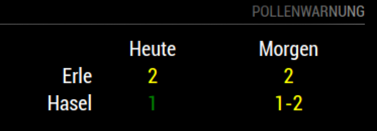
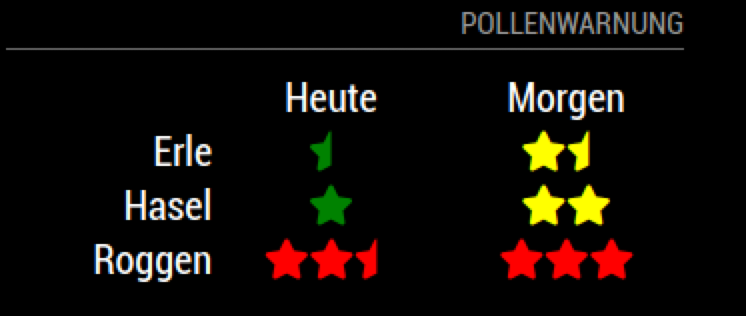

# MMM-DWD-Pollen

This displays Pollen information for GERMANY only.

This [Magic Mirror²](https://github.com/MichMich/MagicMirror) module display the Pollen information from DWD (=Deutscher Wetterdienst)

The data source is from DWD: (https://opendata.dwd.de/climate_environment/health/alerts/s31fg.json) - no license required

For the data source & region data: (https://opendata.dwd.de/climate_environment/health/alerts/Beschreibung_pollen_s31fg.pdf)

This module is derived from: https://github.com/vincep5/MMM-Pollen

## Preview




## Installation
Clone this repository in your `modules` folder, and install dependencies:
```bash
cd ~/MagicMirror/modules # adapt directory if you are using a different one
git clone https://github.com/carstendirks/MMM-DWD-Pollen.git
cd MMM-DWD-Pollen
npm install # this can take a while
```

## Configuration
Add `MMM-DWD-Pollen` module to the `modules` array in the `config/config.js` file: (Simple Example)

```
modules: [
  {
    module: "MMM-DWD-Pollen",
    position: "bottom_right",
    header: "Pollenwarnung",
    config: {
        updateInterval: 1 * 60 * 60 * 1000, // every 1 hour1
        DWD_region: 92, // Rhein Main
	icon: false // Show icons or not
    },
  },
]
```

## Configuration Settings
Here is full documentation of options for the modules configuration:

| Option        | Description   |
| ------------- | ------------- |
| `updateInterval` | Update interval how often information is retrieved. Attention: DWD updates only once per day at 11am CET|
| `DWD_region` | DWD has certain part regions - following a list of part regions for Pollen information in Germany |
| `icon` | true: Show icons, false: Show numbers

DWD Regions:
```
11=Inseln und Marschen 
12=Geest,Schleswig-Holstein und Hamburg 
20=Mecklenburg-Vorpommern 
31=Westl. Niedersachsen/Bremen 
32=Östl. Niedersachsen 
41=Rhein.-Westfäl. Tiefland
42=Ostwestfalen 43=Mittelgebirge NRW 
50=Brandenburg und Berlin 
61=Tiefland Sachsen-Anhalt 62=Harz
71=Tiefland Thüringen
72=Mittelgebirge Thüringen
81=Tiefland Sachsen
82=Mittelgebirge Sachsen
91=Nordhessen und hess. Mittelgebirge
92=Rhein-Main
101=Rhein, Pfalz, Nahe und Mosel 
102=Mittelgebirgsbereich Rheinland-Pfalz
103=Saarland
111=Oberrhein und unteres Neckartal 
112=Hohenlohe/mittlerer Neckar/Oberschwaben 
113=Mittelgebirge Baden-Württemberg
121=Allgäu/Oberbayern/Bay. Wald
122=Donauniederungen
123=Bayern nördl. der Donau, o. Bayr. Wald, o. Mainfranken 124=Mainfranken
```

There is a map that sows all part regions (but you have to match it to the numbers shown above): https://www.dwd.de/DE/leistungen/gefahrenindizespollen/Gebiete.html?nn=16102&lsbId=463856


## License

### The MIT License (MIT)

Copyright © 2020 Carsten Dirks

Permission is hereby granted, free of charge, to any person
obtaining a copy of this software and associated documentation
files (the “Software”), to deal in the Software without
restriction, including without limitation the rights to use,
copy, modify, merge, publish, distribute, sublicense, and/or sell
copies of the Software, and to permit persons to whom the
Software is furnished to do so, subject to the following
conditions:

The above copyright notice and this permission notice shall be
included in all copies or substantial portions of the Software.

**The software is provided “as is”, without warranty of any kind, express or implied, including but not limited to the warranties of merchantability, fitness for a particular purpose and noninfringement. In no event shall the authors or copyright holders be liable for any claim, damages or other liability, whether in an action of contract, tort or otherwise, arising from, out of or in connection with the software or the use or other dealings in the software.**
